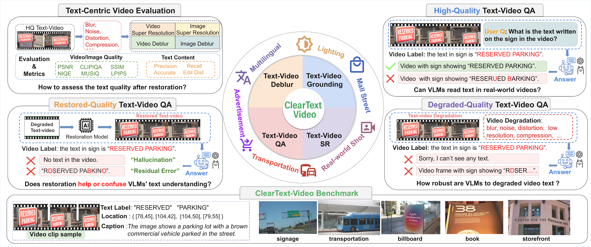
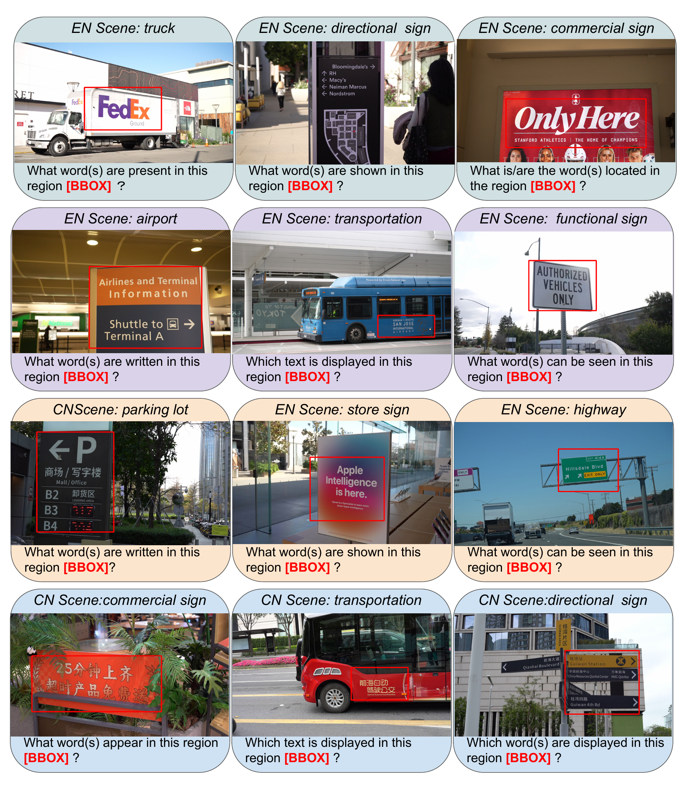
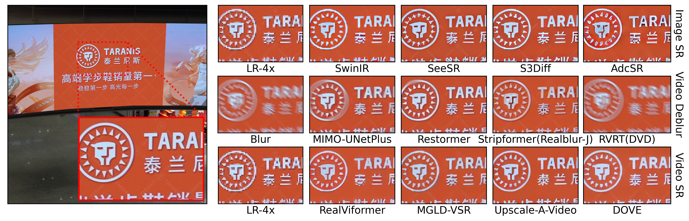
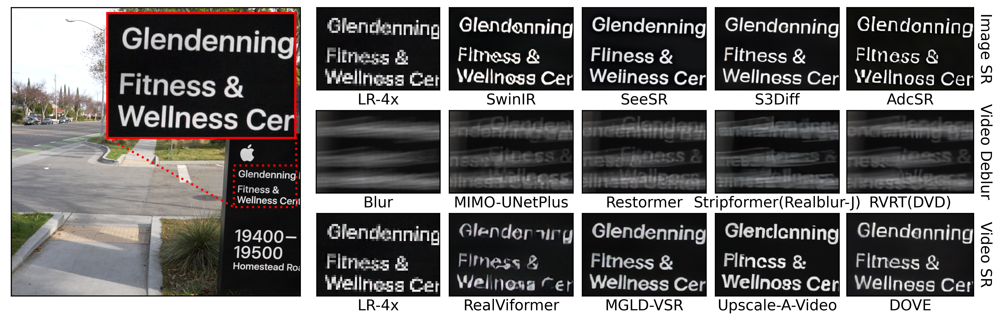
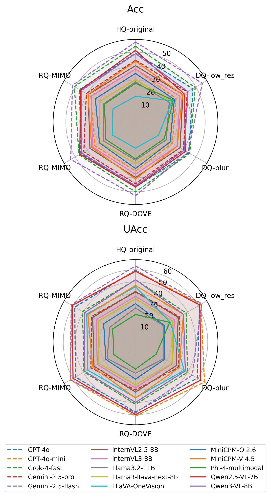

# CTVid-Bench: ClearText-Video Benchmark

[](https://arxiv.org/abs/XXXX.XXXXX)
[](https://huggingface.co/datasets/CTVid/CTVid-Bench)
[](LICENSE)
[](https://creativecommons.org/licenses/by/4.0/)

**ClearText-Video (CTVid)** is the first large-scale, scene-text-aware video QA benchmark
for studying the effect of video quality on text-centric multimodal reasoning.

> 📄 [Paper](https://arxiv.org/abs/XXXX.XXXXX) | 🌐 [Project Page](https://CTVid.github.io) | 🤗 [Dataset](https://huggingface.co/datasets/CTVid/CTVid-Bench) | 🏆 [Leaderboard](https://CTVid.github.io/#leaderboard)



---

## Highlights

- **4,639** real-world text-rich videos · **550K+** frames · **1.6M** scene-text annotations · **220K+** QA pairs
- **Three quality regimes**: High-Quality (HQ), Degraded-Quality (DQ: blur & low-res), Restored-Quality (RQ)
- **Four evaluation tasks**: Spatial QA, Temporal QA, text detection, text recognition
- **Bilingual**: Chinese + English scene text
- Comprehensive evaluation of **18 restoration methods** and **16 state-of-the-art MLLMs**

---

## Dataset Statistics

| Split | Videos | Frames | Text Annotations | QA Pairs |
|-------|--------|--------|-----------------|----------|
| Train | 4,327  | ~511K  | ~1.5M           | ~207K    |
| Test  | 312    | ~37K   | ~120K           | ~13K     |
| **Total** | **4,639** | **550K+** | **1.6M** | **220K+** |

**Open-source test set** (this repo) covers 3 quality variants: GT · blur · downsample_x4

---

## Quick Start

### Installation

```bash
git clone https://github.com/CTVid/CTVid-Bench.git
cd CTVid-Bench
pip install -r requirements.txt
```

### Download Images & Videos

```bash
python tools/download_data.py --split test --variants GT blur downsample_x4
```

Or manually from HuggingFace: see [DATA.md](DATA.md)

### Run Spatial QA Evaluation

```bash
# Evaluate GT videos with Qwen2.5-7B text-only baseline
python evaluation/spatial/run_eval.py \
    --dataset GT \
    --config configs/default.yaml \
    --output_dir outputs/spatial/

# Compute metrics
python evaluation/spatial/metrics.py \
    --results_dir outputs/spatial/ \
    --dataset GT
```

### Run Temporal QA Evaluation

```bash
python evaluation/temporal/run_eval.py \
    --dataset GT \
    --config configs/default.yaml \
    --output_dir outputs/temporal/

python evaluation/temporal/metrics.py \
    --results_dir outputs/temporal/ \
    --dataset GT
```

---

## Dataset Visualizations

### Annotation Pipeline


### Sample Video Clips


### Qualitative Restoration Results
| Chinese | English |
|:--:|:--:|
|  |  |

### MLLM Performance Radar


---

## Repository Structure

```
CTVid-Bench/
├── data/
│   ├── spatial_qa/annotations/       # QA annotation JSONs (GT/blur/downsample_x4)
│   └── temporal_qa/annotations/      # Temporal QA JSONs
├── evaluation/
│   ├── spatial/                       # Spatial QA eval scripts
│   └── temporal/                      # Temporal QA eval scripts
├── tools/
│   ├── download_data.py               # HuggingFace dataset downloader
│   └── visualize.py                   # Visualize QA examples
├── project_page/                      # GitHub Pages project website
├── examples/                          # Demo notebooks
├── configs/default.yaml               # Path configuration
├── requirements.txt
├── DATA.md                            # Detailed data download instructions
└── LICENSE
```

---

## Evaluation Tasks

### Task 1 — Text-Centric VideoQA for Spatial Understanding

Evaluates scene-text recognition within spatial context per video frame.

| Question Type | Description | Example |
|--------------|-------------|---------|
| Fill-in-blank | Identify missing characters in a bounding box | `"capy____"` → `"bara"` |
| Multiple-choice | Select the text in a given region | `A/B/C/D` |
| True/False | Verify text presence in a region | `Yes/No` |

**Metrics**: Accuracy (Acc), Uncertainty-aware Accuracy (UAcc), Over-confidence Ratio (OC)

### Task 2 — Text-Centric VideoQA for Temporal Understanding

Evaluates text motion, visibility, and dynamics across 120-frame video clips.

| Category | Questions | Example |
|---------|-----------|---------|
| Presence | 6 | "In how many frames is X visible?" |
| Localization | 6 | "Which region does X spend most time in?" |
| Motion | 9 | "What is the main motion direction of X?" |
| Size | 6 | "In which frame does X have the largest area?" |
| Boundary | 1 | "Does X touch the screen edge?" |

**Metrics**: Category-level accuracy with ±2-frame tolerance for numeric answers

---

## Leaderboard

Results on the test set (HQ / DQ-blur / DQ-low_res):

| Model | Spatial Acc (HQ) | Temporal Acc (HQ) |
|-------|-----------------|------------------|
| Gemini-2.5-flash | 57.14% | 40.12% |
| Gemini-2.5-pro | 55.83% | 42.19% |
| Qwen2.5-VL-7B | 51.21% | 35.67% |
| Kimi-VL-16B | 49.38% | 38.31% |
| *more in paper* | | |

Submit results: open a GitHub Issue with your model card.

---

## Citation

```bibtex
@inproceedings{ctvid2026,
  title     = {ClearText-Video: A Large-Scale Text-Centric Video Dataset
               Bridging Video Restoration and Scene-Text Enhancement},
  booktitle = {CVPR},
  year      = {2026},
}
```

---

## License

- **Code**: MIT License
- **Data**: CC BY 4.0
