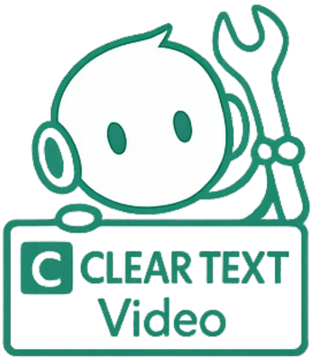
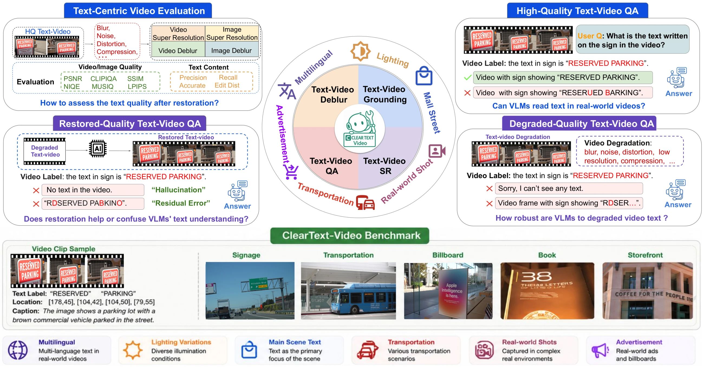
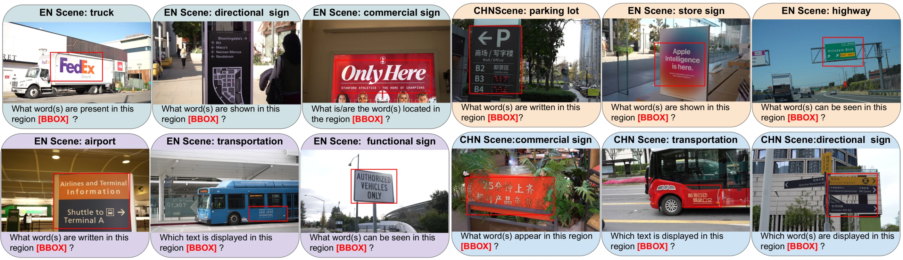
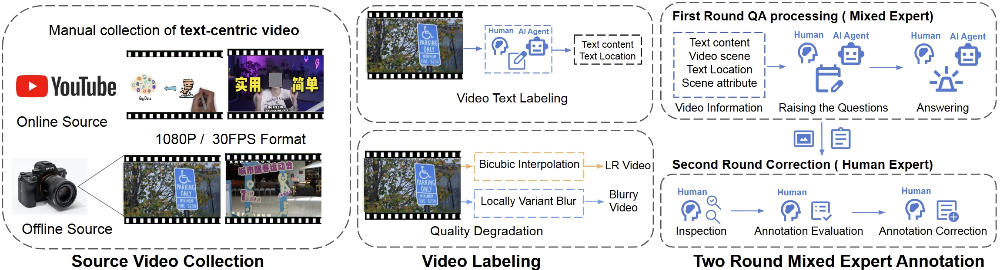
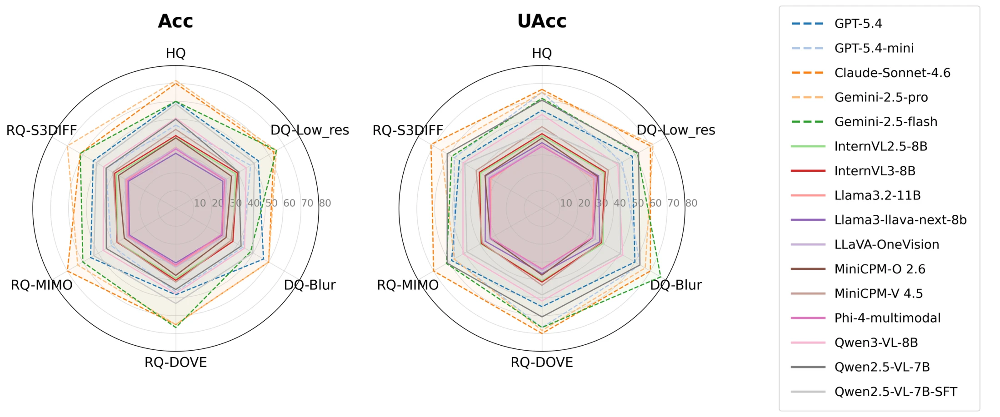

<div align="center">
  

  <h1>ClearText-Video</h1>
  <p><strong>A Large-Scale Text-Centric Video Dataset Bridging<br>Video Restoration and Scene-Text Enhancement</strong></p>
  <p>ECCV 2026</p>

  <a href="https://jinlong17.github.io/CTVid-Bench/static/paper/ClearText_Video_arXiv_20260825.pdf"></a>
  <a href="https://jinlong17.github.io/CTVid-Bench/"></a>
  <a href="https://huggingface.co/datasets/jinlong17/CTVid-Bench"></a>
  <a href="LICENSE"></a>

  <p>
    <a href="https://jinlong17.github.io/CTVid-Bench/"><strong>Project Page</strong></a> ·
    <a href="https://jinlong17.github.io/CTVid-Bench/static/paper/ClearText_Video_arXiv_20260825.pdf"><strong>Paper PDF</strong></a> ·
    <a href="https://huggingface.co/datasets/jinlong17/CTVid-Bench"><strong>Dataset</strong></a> ·
    <a href="#quick-start"><strong>Quick Start</strong></a> ·
    <a href="#benchmark-results"><strong>Results</strong></a>
  </p>
</div>

---

## Overview

**ClearText-Video (CTVid)** is a large-scale, scene-text-aware benchmark for studying text-centric video understanding under controlled quality variation. It pairs every high-quality source with content-matched degraded and restored variants, connecting **Text-Centric Video Restoration** with **Multi-Quality VideoQA**.

The central question is simple: **does a video that looks better also preserve the textual evidence a multimodal model needs?**

<p align="center">
  
</p>

### At a glance

| Videos | Frames | Human-verified annotations | Spatial & temporal QA | Languages |
|:--:|:--:|:--:|:--:|:--:|
| **4,639** | **550K+** | **1.6M** | **220K+** | **Chinese + English** |

- **4,327 training videos** and **312 testing videos**.
- Quality-controlled **HQ**, **DQ-Low_res**, **DQ-Blur**, **RQ-DOVE**, **RQ-MIMO**, and **RQ-S3DIFF** conditions in the full benchmark.
- Evaluation of **18 restoration methods** and **16 multimodal LLMs**.
- Two rounds of annotation and correction by **16 annotators**, starting from **6.4K+ candidate videos**.

> [!IMPORTANT]
> The current public Hugging Face release contains **GT**, **blur**, and **downsample_x4**. DOVE, MIMO and S3DIFF are full-paper evaluation conditions and are not part of the current public download.

## Authors

Jinlong Li<sup>*†</sup>, Jiaming Ding<sup>*</sup>, Dingfu Lu<sup>‡</sup>, Malcolm Hsiu<sup>‡</sup>, Chuang Ke, Kangning Yang, Bochen Guan, Lan Fu, Jie Cai, Huiming Sun, Zibo Meng

OPPO US AI Center · University of Wisconsin–Madison · University of California San Diego

<sub><sup>*</sup> Equal contribution · <sup>†</sup> Corresponding author · <sup>‡</sup> Work done during internships at OPPO US AI Center</sub>

## Dataset

### Quality regimes

| Regime | Conditions | Purpose |
|---|---|---|
| **HQ** | Original high-quality video | Reference textual evidence |
| **DQ** | Low resolution, locally variant blur | Controlled robustness testing |
| **RQ** | DOVE, MIMO, S3DIFF | Test whether restoration preserves or changes evidence |

### Benchmark tasks

1. **Text-Centric Video Restoration** — image super-resolution, video super-resolution and video deblurring, evaluated with visual-quality and text-fidelity metrics.
2. **Spatial VideoQA** — text recognition and grounding within frame-level context, evaluated with Accuracy (Acc), Unbiased Accuracy (UAcc), Overconfidence (OC) and Answer Abstention (Abs).
3. **Temporal VideoQA** — text presence, localization, motion, scale and boundary reasoning across video frames.

<p align="center">
  
</p>

<details>
<summary><strong>Dataset split and annotation details</strong></summary>

| Split | Videos | Notes |
|---|---:|---|
| Train | 4,327 | Large-scale training supervision |
| Test | 312 | 74% offline / 26% online; balanced Chinese and English coverage by source |

Question difficulty is distributed as **46% easy**, **37% medium**, and **17% hard**.

<br>


</details>

## Benchmark results

The final paper shows that visual enhancement does **not** guarantee textual fidelity or downstream reasoning gains.

- Across 16 MLLMs, low resolution reduces spatial QA accuracy by **3.14 points** from HQ, while blur reduces it by **6.05 points**.
- **Gemini-2.5-pro** reaches the best spatial HQ accuracy at **71.67%**.
- **Claude-Sonnet-4.6** ranks first across all five temporal quality conditions, reaching **60.02%** on HQ and **60.37%** on RQ-DOVE.
- **Qwen2.5-VL-7B-SFT** is the strongest open-source model by accuracy across all six spatial quality conditions, improving **6.31–10.11 points** over its base model.

### Best spatial accuracy by condition

| Condition | Best model | Accuracy (%) |
|---|---|---:|
| HQ | Gemini-2.5-pro | **71.67** |
| DQ-Low_res | Gemini-2.5-pro | **65.00** |
| DQ-Blur | Claude-Sonnet-4.6 | **60.00** |
| RQ-DOVE | Gemini-2.5-flash | **66.67** |
| RQ-MIMO | Claude-Sonnet-4.6 | **70.00** |
| RQ-S3DIFF | Gemini-2.5-pro | **70.00** |

<p align="center">
  
</p>

## Quick start

### 1. Install

```bash
git clone https://github.com/jinlong17/CTVid-Bench.git
cd CTVid-Bench
pip install -r requirements.txt
```

### 2. Download the public test variants

```bash
python tools/download_data.py \
  --split test \
  --variants GT blur downsample_x4
```

See [DATA.md](DATA.md) for the Hugging Face layout, paths and manual download options.

### 3. Run spatial VideoQA

```bash
python evaluation/spatial/run_eval.py \
  --dataset GT \
  --config configs/default.yaml \
  --output_dir outputs/spatial/

python evaluation/spatial/metrics.py \
  --results_dir outputs/spatial/ \
  --dataset GT
```

### 4. Run temporal VideoQA

```bash
python evaluation/temporal/run_eval.py \
  --dataset GT \
  --config configs/default.yaml \
  --output_dir outputs/temporal/

python evaluation/temporal/metrics.py \
  --results_dir outputs/temporal/ \
  --dataset GT
```

## Repository layout

```text
CTVid-Bench/
├── configs/default.yaml
├── docs/
│   ├── review_spatial_qa.md
│   └── review_temporal_qa.md
├── evaluation/
│   ├── spatial/
│   └── temporal/
├── project_page/                 # GitHub Pages source
├── tools/download_data.py
├── DATA.md                       # Public data release guide
└── requirements.txt
```

## Citation

```bibtex
@inproceedings{li2026cleartextvideo,
  title     = {ClearText-Video: A Large-Scale Text-Centric Video Dataset
               Bridging Video Restoration and Scene-Text Enhancement},
  author    = {Li, Jinlong and Ding, Jiaming and Lu, Dingfu and Hsiu, Malcolm
               and Ke, Chuang and Yang, Kangning and Guan, Bochen and Fu, Lan
               and Cai, Jie and Sun, Huiming and Meng, Zibo},
  booktitle = {European Conference on Computer Vision},
  year      = {2026}
}
```

## License

- **Code:** [MIT License](LICENSE)
- **Public data:** [CC BY 4.0](https://creativecommons.org/licenses/by/4.0/)

---

<div align="center">
  <sub>Website, figures and metadata synchronized with the final 25 August 2026 release source.</sub>
</div>
